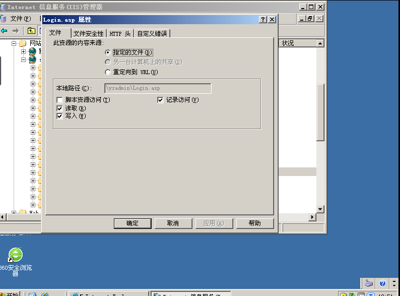
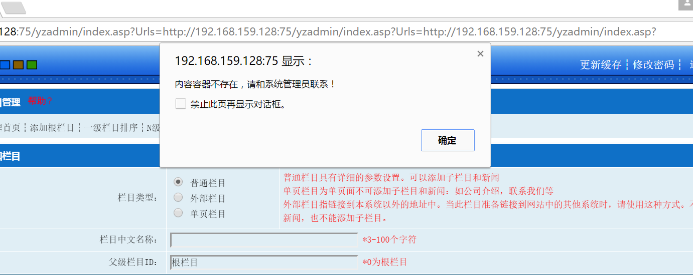
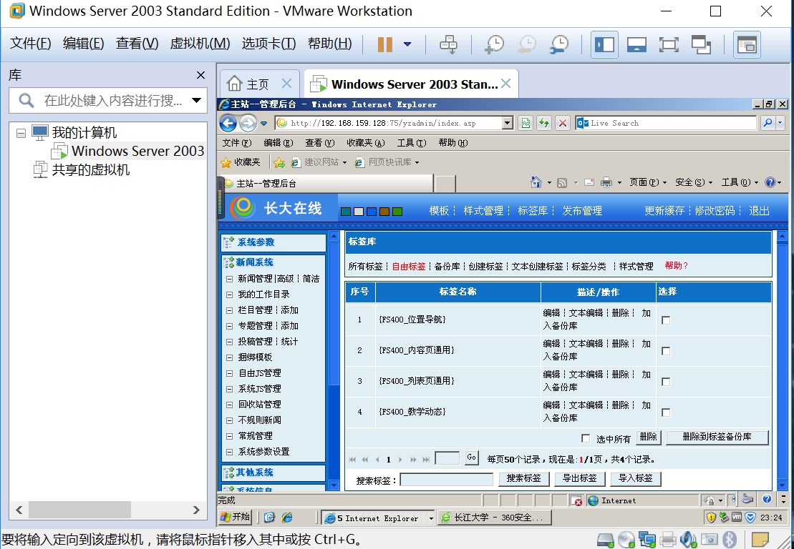
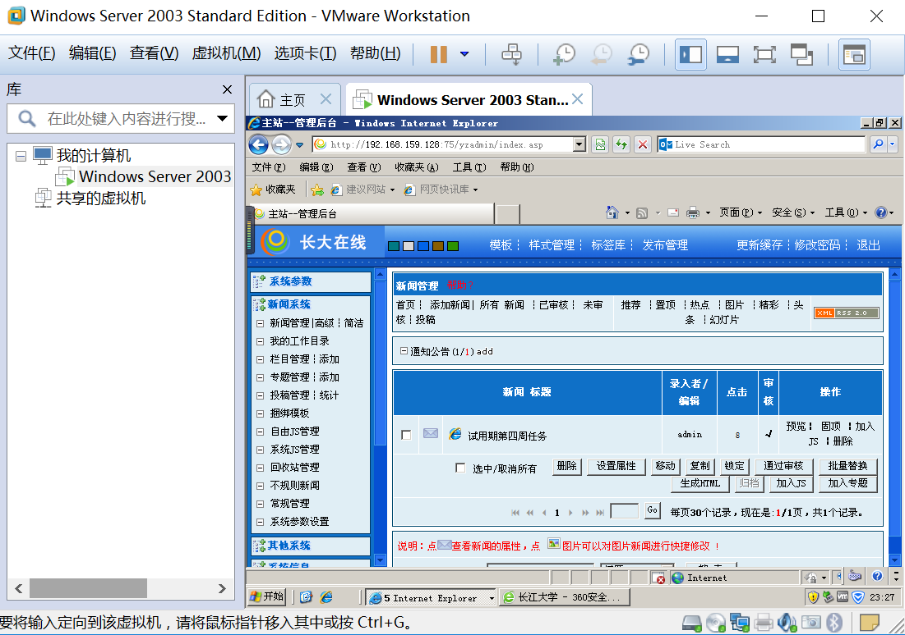

<h2>第四周任务</h2>

- - - 

一开始我并没有具体的记录每一步，因为从安装虚拟机开始我就出了很多状况，无法打开windows sever 2003，还进入了BOIS修改了一些设置，一直到星期二才弄好。我下载的2003是标准版，因为之前我在给的参考资料里下载的企业版打开之后网页出现了问题，所以我又下载了标准版，打开之后没有问题，不知道2003的版本有没有要求

* * *

<h2>搭建后台</h2>

其实在开始的过程中一切都很顺利,每一步教程里面都有，基本没有太多的区别，就是后来出了点状况导致我又重新安装了一遍,这里的状况会在后来详提到。

- - - 

<h2>进入网站</h2>

其实在进入登陆页面时，我出了点小状况，我按照教程里找到了指定的asp,但是我是双击进去的，是这样，发现一直进不去，我还在网上百度了很长时间，我后来又把视频倒过来看发现是点击右键进去的。

----------
<h2>IP地址</h2>

当我输完IP地址后，发现在虚拟机外面打开时是无法找到网页，后来我修改了好几次，甚至还在网上搜IP地址是什么，结果我换了个浏览器打开就好了。无奈。

----------

<h2>导入模板</h2>

因为我自己之前没有写列表页和内容页所以我就把组长写的导入了。但是不知道是不是风讯的 问题，导入之后一些属性不能表现，所以我就修改一下，对于导入的模板，一开始我的网页都调试过，但是还是排版出现了问题，所以我就上网搜，不管怎么弄，都弄不好，于是我就问了组长，后来我发现是因为我用了IE7。换成IE8后，问题就解决了。关于代码转换问题，我是根据教程来的，不过后来我也在Visual Studio Code上成功的把代码换成了gb2312,

----------
<h2>创建栏目</h2>

我记得我第一次创建栏目之后，想要删除，结果一不小心点错了，虽然是删除了但是出现了这样的问题,，我也在网上搜了一些人和我一样，但是没有看到解决的办法，于是我就重新搭建后台，结果再打开还是这样，这就是我之前提到的状况，最后我碰巧发现在虚拟机里面打开发现提示不见了，但是一放到主机上又出现了提示，因此之后的操作都是在虚拟机里进行的。

----------

后来的新闻发布和其他的都还比较顺利都成功创建

----------

最后想在这里发表一下对mark down的使用，刚下载完这个，百度了一下，发现html的语言可以在这个上面用，开始时，连图片都不会上传，在网上百度了很多都没有解决最后还是想起了html的图片导入，结果一试就成功了。暗暗窃喜，还想在这里表达对百度和学长的爱心便当通关秘籍的感谢。

